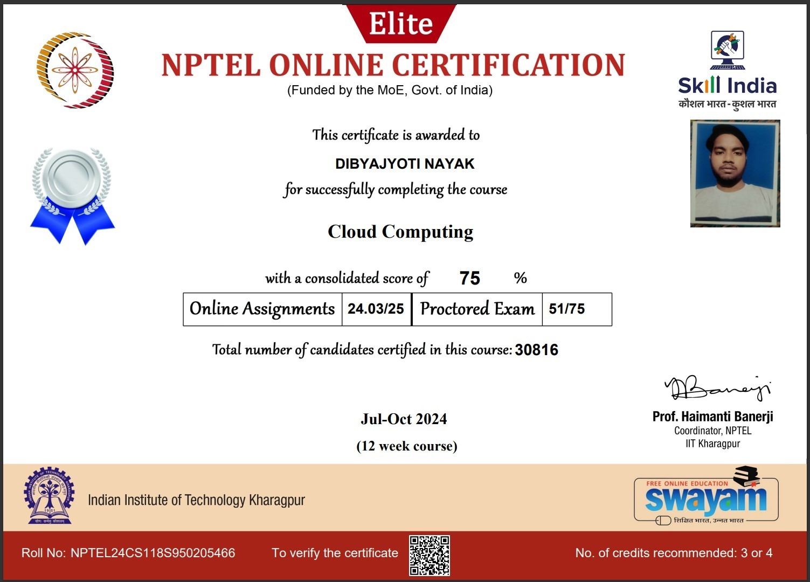
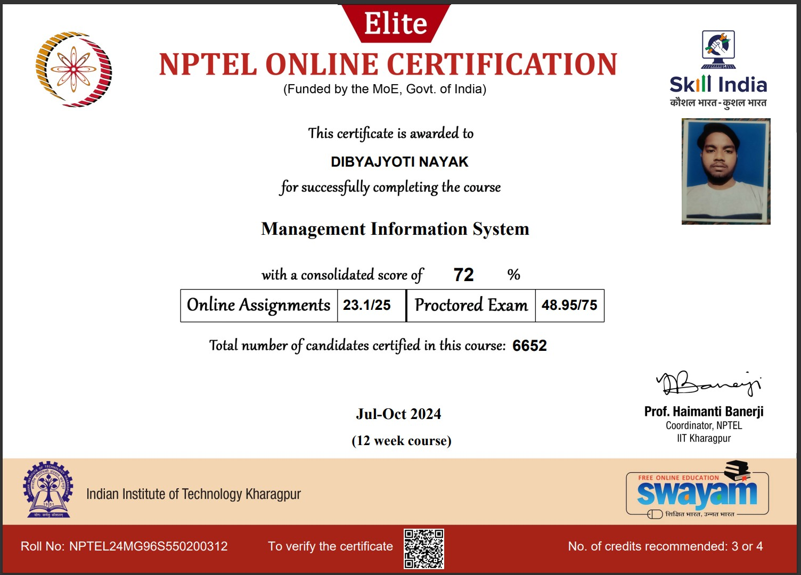

<h1 align="center" style="color:#FF5733;">Hi 👋, I'm DIBYAJYOTI NAYAK</h1>
<h3 align="center" style="color:#DAF7A6;">✨ A Passionate DevOps Engineer from India ✨</h3>

 
   
  

---

### 🚀 About Me:
- 🔬 **I’m currently working on:** [DevOps Project](mailto:ndibyajyotinayak@gmail.com)  
- 🌱 **I’m currently learning:** **DevOps with AWS**  
- 💝 **I’m looking to collaborate on:** **Exciting DevOps Projects**  
- 🤝 **I’m looking for help with:** **Advanced DevOps Automation**  
- 💭 **Ask me about:** **DevOps, AWS, and Cloud Solutions**  
- 📧 **How to reach me:** [ndibyajyotinayak@gmail.com](mailto:ndibyajyotinayak@gmail.com)  

---

### 🌐 Connect with Me:

  
  

---
### 🔧 Skills and Tools:

  

    
    
AWS

  

  

    
    
Docker

  

  

    
    
Kubernetes

  

  

    
    
Git

  

  

    
    
Linux

  

  

    
    
Jenkins

  

  

    
    
Python

  

  

    
    
Core Java

  

  

    
    
JavaScript

  

  

    
    
HTML5

  

  

    
    
Ansible

  

  

    
    
Maven

  

  

    
    
HCP Cloud

  

  

    
    
Prometheus

  

  

    
    
Grafana

  

  

    
    
Selenium

  

---

### 📊 GitHub Stats:

  
  
  

---

### 🏆 Achievements:
<h2 align="center">🎓 NPTEL CERTIFICATES 🎓</h2>

  
  

<ul>
  <li><strong>Certificate 1 Score:</strong> 75/100</li>
  <li><strong>Certificate 2 Score:</strong> 72/100</li>
</ul>

---

### 🎉 Fun Fact:
- ⚡ **I love exploring new tech and sharing knowledge!**
- 🐾 **I have a vegetarian Pitbull and a cat as my companions!**

